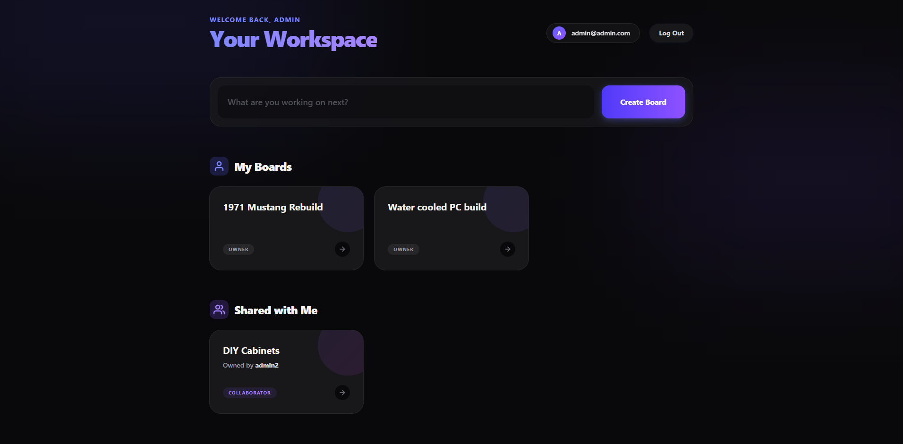

# ⚡️ Real-Time Premium Kanban Workspace


<div align="center">
  
</div>
<br />

A hyper-modern, full-stack collaboration platform inspired by premium SaaS tools. It allows teams to create isolated workspaces, invite collaborators, and manage tasks using a highly optimized drag-and-drop interface. Powered by a decoupled architecture, it features real-time WebSocket synchronization, custom JWT authentication, and a scalable PostgreSQL database.

## 🚀 Live Deployments

- 🌐 **Frontend (Vercel):** [https://real-time-kanban.vercel.app/](https://real-time-kanban.vercel.app/)
- ⚙️ **Backend (Render):** REST API & WebSocket Server
- 🗄️ **Database (Supabase):** Cloud PostgreSQL

### 🔑 Live Demo Access
To test the real-time collaboration and board management features, create a free account or use the test credentials:
- **Email:** `admin@admin.com`
- **Password:** `admin`

## ✨ Features Achieved

- **Real-Time WebSockets:** Live multi-player synchronization powered by Socket.io. Features live cursor tracking indicating exactly where collaborators are currently viewing, and instant board updates across all connected clients.
- **Custom JWT Authentication:** A fully independent, secure authentication pipeline built from scratch using NestJS, Passport, and Bcrypt. Features stateless JWT session persistence and strict HTTP-only route guarding.
- **Optimized Drag & Drop:** Buttery-smooth card manipulation utilizing `@hello-pangea/dnd`. Engineered with advanced CSS architectures to prevent "containing block" bugs and z-index clipping while maintaining complex glassmorphic UI filters.
- **Workspace List Management:** Full CRUD capabilities allowing users to dynamically rename, organize, and permanently delete task columns with instant real-time synchronization across the workspace.
- **Hyper-Modern UI/UX:** Built with Tailwind CSS, featuring native System Dark/Light Mode support, frosted glass styling (`backdrop-blur`), customized scrollbars, dynamic glowing background gradients, and hover-to-reveal contextual menus.
- **Concurrency & Editing Locks:** Prevents data collision by visually locking cards and displaying dynamic "User is editing" badges to teammates when a card is actively being modified by another collaborator.
- **Role-Based Workspaces:** Granular ownership models. Board owners maintain full destructive control (deleting boards, renaming lists), while invited collaborators are restricted to card/column manipulation.

## ⚙️ Runtimes, Engines, and Tools

To run this project locally, the following environment is required:

### Runtimes & Package Managers
- **Node.js:** `v24.14.0`
- **npm:** `v11.16.0`
- **OS**: Windows, macOS, or Linux

### Core Dependencies & Engines
- **Frontend:** React `v19.2.7`, Vite `v8.0.16`, React Router `v7.17.0`, @hello-pangea/dnd `v18.0.1`, Tailwind CSS `v4.3.1`, Zustand `v5.0.14`
- **Backend:** NestJS `v11.1.26`, TypeORM `v1.0.0`, Socket.io `v4.8.3`, Passport `v0.7.0`, NestJS/JWT `v11.0.2`
- **Database:** PostgreSQL (pg `v8.21.0`)

## 🚀 How to Run Locally

### 1. Clone the repository
```bash
git clone [https://github.com/notrexxx/real-time-kanban.git](https://github.com/notrexxx/real-time-kanban.git)
cd real-time-kanban
```

### 2. Backend Setup
Open a terminal and navigate to the backend folder:
```bash
cd backend
npm install
```
Create a `.env` file in the `/backend` directory:
```text
PORT=3000
DATABASE_URL=your_local_or_cloud_postgres_connection_string
JWT_SECRET=your_super_secret_key
```
Start the NestJS server:
```bash
npm run start:dev
```

### 3. Frontend Setup
Open a *new* terminal and navigate to the frontend folder:
```bash
cd frontend
npm install
```
Create a `.env` file in the `/frontend` directory:
```text
VITE_API_URL=http://localhost:3000
```
Start the Vite development server:
```bash
npm run dev
```

## 🗄️ Database Schema

The backend utilizes TypeORM to automatically generate and synchronize four core relational tables:

* `users`: Secures encrypted passwords and identity data.
* `boards`: The root workspace entity, containing a Many-to-One relationship to its owner.
* `columns`: Tracks sorting order and groups cards, containing a Many-to-One relationship to a specific board.
* `cards`: The atomic task entity, holding descriptions and maintaining a Many-to-One relationship to its parent column.
* *Join Tables*: Automatically handles Many-to-Many relationships for invited board collaborators.

## Author

👤 **Andres Leon**

- GitHub: [@notrexxx](https://github.com/notrexxx)
- LinkedIn: [Emigdio Leon](https://linkedin.com/in/emigdio-leon-689109195)